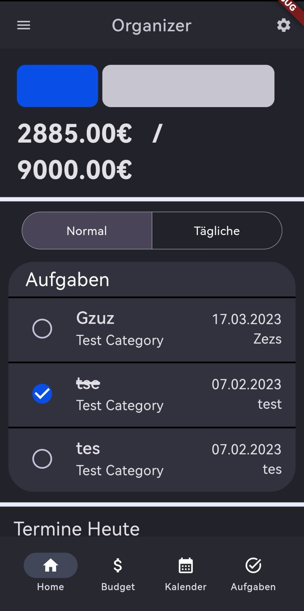

# Organzier App

Unsere Organizer App ist eine Flutter App, die dir dabei hilft, dein Leben zu organisieren. Dabei ist sie in drei Teile aufgeteilt: Budget, Termine und Aufgaben. Die App verbindet diese drei Teile, um eine Verbesserung deiner Organisation zu bieten.
Die App wird als Abgabe für das Modul "Konzepte der Android Programmierung" an der Hochschule Fulda im WS 22/23 entwickelt.

## Funktionen

### Home

Die Home-Seite zeigt dir einen Überblick über deine aktuelle Situation. Hier findest du    
Informationen zu deinem Budget, deinen Terminen und deinen Aufgaben. Über die BottomNavigationBar    
kannst du zwischen den drei Themen wechseln.

### Budget

Der Budget-Teil der App bietet dir die Möglichkeit, deine Finanzen im Blick zu behalten. Ein    
Balkendiagramm zeigt dir, wie viel Geld du von deinem Budget bereits diesen Monat ausgegeben hast und wie viel Geld du noch zur Verfügung hast. Unter dem Balken befindet sich dann eine Auflistung von verschiedenen Ausgaben mit ihrem Namen, ihrer Kategorie und ihrem Betrag. Es ist möglich neue Ausgaben und Kategorien hinzuzufügen, zu bearbeiten und zu löschen.

### Termine

Über den Termin-Planer kannst du alle deine Termine organisieren. Du kannst neue Termine hinzufügen,    
Termine bearbeiten und löschen. Außerdem kannst du dir einen Überblick über deine Termine der    
nächsten Tage verschaffen, die sowohl als Liste aufgeführt werden und in einem Kalender veranschaulicht werden.

### Aufgaben

Der Aufgaben-Teil der App bietet dir die Möglichkeit, deine täglichen/wiederkehrende Aufgaben sowie    
größere/längere Aufgaben zu organisieren. Du kannst neue Aufgaben hinzufügen, Aufgaben bearbeiten    
und löschen.  Die Aufgaben sind aufgebaut wie ein To-Do, die abgehackt werden können.

## Entwicklung und Installation

Um die App zu installieren, musst du Flutter und Dart auf deinem Computer installieren. Anschließend    
kannst du das Repository klonen und die App auf deinem Emulator oder auf deinem Smartphone    
ausführen.

```bash
git clone git@github.com:DerKrull/OrganizerApp.git  
```  

## Verwendete Technologien

- [Flutter](https://flutter.dev)
- [Firebase](https://firebase.google.com)
- [Material 3 Design](https://m3.material.io)
- [GetX](https://pub.dev/packages/get)

## Beispiel HomeScreen



## Team

+ [Jonas Wagner](https://github.com/choan312)
+ [Felix Krull](https://github.com/DerKrull)